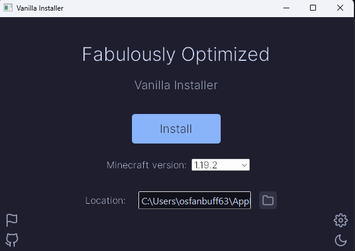

# v0.1.0 (summary)

The first beta for Fabulously Optimized's Vanilla Installer has been released! Most features are complete, however there's still some bugs and lots of testing to do before a full 1.0.0 release. Please report any bugs you find on the [issue tracker](https://github.com/Fabulously-Optimized/vanilla-installer/issues/new/choose)

## Known issues

- The font won't apply immediately:

The workaround is to switch the theme twice (it works to just do it once but if you click the button twice you get the same theme).

**Full Changelog on [the wiki](https://fabulously-optimized.gitbook.io/vanilla-installer/0.1.0/full)!**
