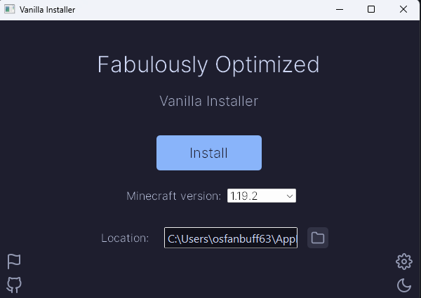
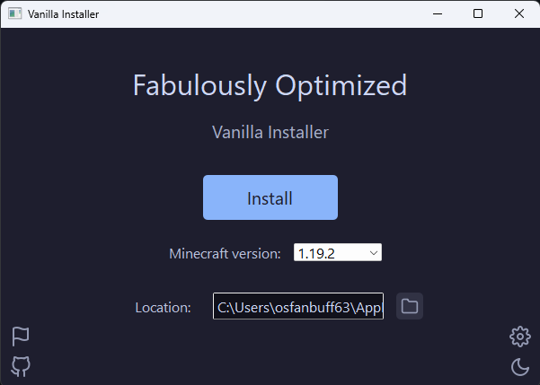

# v1.0.0-b1 (full)

## New features

- A GUI interface, including light and dark modes powered by [Catppuccin](https://github.com/catppuccin) ([#31](https://github.com/Fabulously-Optimized/vanilla-installer/pull/31))
- Automatic download of the required libraries and installation for the Packwiz version of Fabulously Optimized
  - The installation includes installing Fabric and creating a new profile for Fabulously Optimized with its logo
- A JSON file to show what Minecraft versions you can download Fabulously Optimized for

## Known issues

- The font won't apply immediately:

The workaround is to switch the theme twice (it works to just do it once but if you click the button twice you get the same theme).

## Credits

A big thanks to everyone that has helped us get to this point!

- [@nsde](https://github.com/nsde), for starting the project.
- [@Madis0](https://github.com/madis0), for creating Fabulously Optimized.
- [@RaptaG](https://github.com/RaptaG), for working on the Bash scripts.
- [@Tuxinal](https://github.com/Tuxinal) and [@RozeFound](https://github.com/RozeFound), for helping out with some major features.
- [@comp500](https://github.com/comp500), for creating Packwiz which allows this to work.
- Any other contributors to this project that I may have forgotten.
- All of the mod developers and contributors that make Fabulously Optimized possible, as this project wouldn't exist without them!
  
More credits for the libraries we use and things can be found [here](/credits)!
